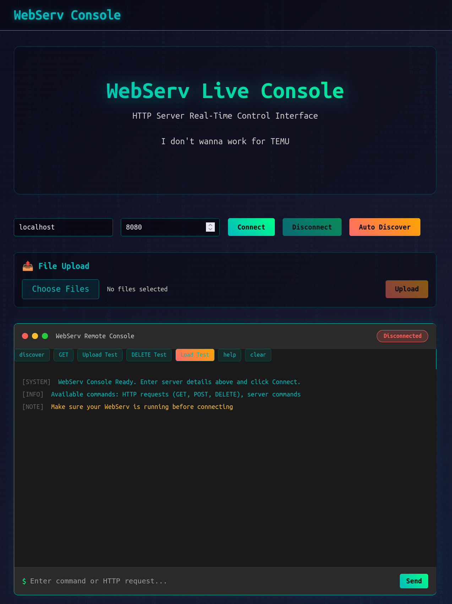
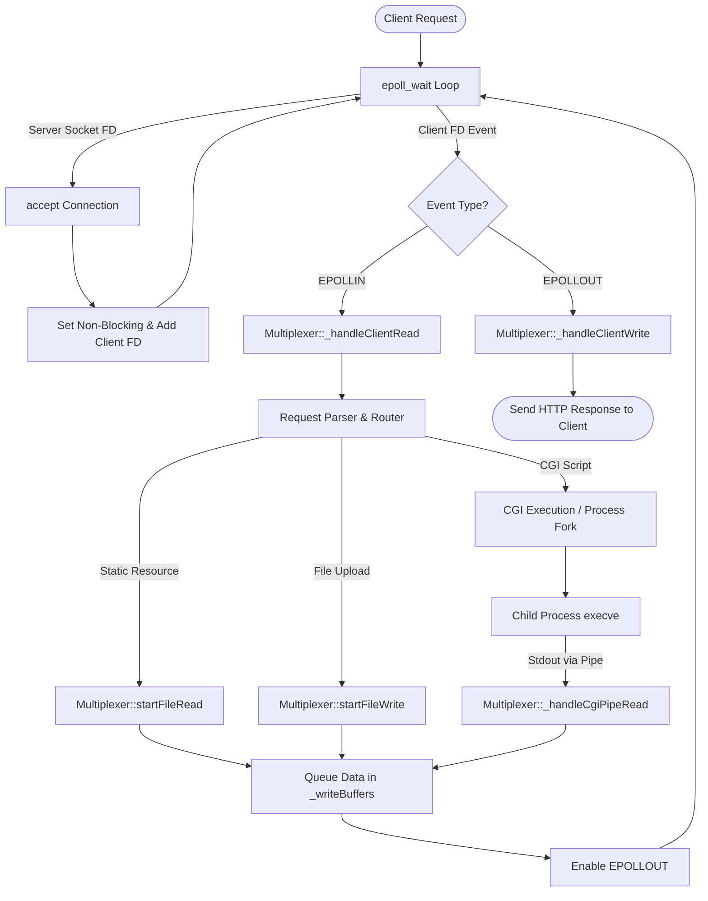

# 42 Cursus : WebServ

<p align="center">
  <a href="https://github.com/42Monkey/get_next_line">
    
  </a>
</p>

## Description

**WebServ** is an HTTP/1.1 web server built from scratch in C++98.

Instead of spawning threads per connection, it uses a non-blocking I/O event loop `epoll`.

All client sockets, static files, upload pipes, and CGI child processes are multiplexed through a single event queue.

## Preview

<p align="center">
  
</p>


## Highlights

- Non-blocking I/O multiplexing (`epoll` driven)
- Streamlined HTTP/1.1 request parser and response engine
- Full support for `GET`, `POST`, and `DELETE` methods
- Non-blocking file streaming for downloads and uploads
- Asynchronous CGI execution via process pipes (`.py`, `.php`)
- Path-traversal protection and custom error page routing
- Graceful signal handling (`SIGCHLD` process reaping)
- Written in C++98 without third-party libraries or external dependencies

## Instructions

```sh
# Compile the WebServ
make

# Run with a configuration file
./webserv config/axolotol.conf

# Simple GET
curl -v http://localhost:8080/

# POST upload
curl -X POST -F "file=@test.txt" http://localhost:8080/upload

# DELETE
curl -X DELETE "http://localhost:8080/upload?file=test.txt"

# displays active client connections
status

# terminates the multiplexer and exits
exit
```

## Diagram



## Key Files

| Module | What it does |
| --- | --- |
| [`main.cpp`](https://github.com/42Monkey/42-WebServ/tree/master/main.cpp) | Entry point, handles config loading and top-level launch |
| [`Multiplexer.cpp`](https://github.com/42Monkey/42-WebServ/tree/master/source/Multiplexer.cpp) | Central event loop (`epoll`), manages sockets and pipes |
| [`WebServer.cpp`](https://github.com/42Monkey/42-WebServ/tree/master/source/WebServer.cpp) | Core server engine, processes HTTP methods and responses |
| [`Parser.cpp`](https://github.com/42Monkey/42-WebServ/tree/master/source/Parser.cpp) / [`Lexer.cpp`](https://github.com/42Monkey/42-WebServ/tree/master/source/Lexer.cpp) | NGINX-style configuration tokenizer and validator |
| [`Router.cpp`](https://github.com/42Monkey/42-WebServ/tree/master/source/Router.cpp) | Matches incoming requests to Server and Location blocks |
| [`CGI.cpp`](https://github.com/42Monkey/42-WebServ/tree/master/source/CGI.cpp) | Sets up CGI environment variables, pipes, and `execve` |
| [`Request.cpp`](https://github.com/42Monkey/42-WebServ/tree/master/source/Request.cpp) / [`Response.cpp`](https://github.com/42Monkey/42-WebServ/tree/master/source/Response.cpp) | HTTP request parser and status response generator |

## Design

**Non-Blocking Multiplexing Engine**
- A single epoll instance monitors all file descriptors simultaneously (listening sockets, client connections, file reads/writes, and CGI output pipes).
- Zero blocking read/write calls across all network and process I/O.

**Config-Driven Router**
- Supports location block matching (prefix path matching), host/port binding, custom error page mapping, autoindex directory listing generation, and max body size limits.

**Asynchronous CGI Execution**
- CGI scripts run isolated in child processes created via fork() and execve().
- Standard output and input are bound to non-blocking pipes managed by the main Multiplexer thread to avoid blocking the event loop.

## Readings

**Books**

* **Unix Network Programming, Volume 1: The Sockets Networking API** *(W. Richard Stevens)*
  * Chapter 4: Elementary TCP Sockets
  * Chapter 5: TCP Client/Server Example
  * Chapter 6: I/O Multiplexing (`select`, `poll`, `epoll`)
  * Chapter 16: Nonblocking I/O
  * Chapter 8: Elementary UDP Sockets *(reference)*
* **HTTP: The Definitive Guide** *(David Gourley & Brian Totty)*
  * Chapter 1: Overview of HTTP
  * Chapter 3: HTTP Messages
  * Chapter 4: Connection Management
  * Chapter 9: Web Robots *(server behavior)*
  * Chapter 17: Content Negotiation and Transcoding
  * Chapter 20: Redirection and Load Balancing
* **Advanced Programming in the UNIX Environment** *(W. Richard Stevens)*
  * Chapter 13: Daemon Processes
  * Chapter 14: Advanced I/O *(non-blocking concepts)*
* **The C++ Programming Language** *(Bjarne Stroustrup)*
  * Standard Library Containers, Strings, and I/O Streams

**Articles**

- [M4nnb3ll - Building a non-blocking web server](https://m4nnb3ll.medium.com/webserv-building-a-non-blocking-web-server-in-c-98-a-42-project-04c7365e4ec7)
- [CodeQuoi - Sockets and Network Programming](https://www.codequoi.com/en/sockets-and-network-programming-in-c/)
- [Shichao - I/O Multiplexing](https://notes.shichao.io/unp/ch6/)

---

**Contributors**

- **[@yaokaiyuan](https://github.com/yaokaiyuan)** : CGI, Sockets, Multiplexer (epoll), async file/CGI integration
- **[@42Monkey](https://github.com/42Monkey)** : Lexer, Parser, Request & Response, Configuration system

There are two kinds of 42 students: those who did WebServ, and those who did ft_irc.


